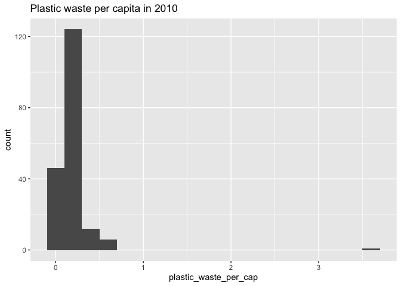
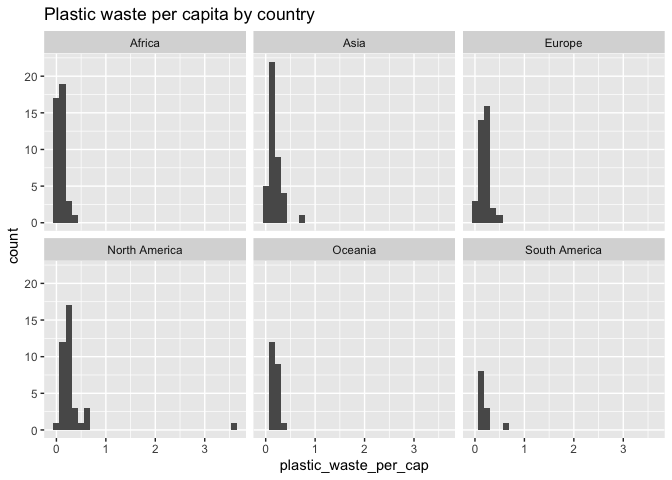

Lab 02 - Plastic waste
================
Lilly McClendon
2025-01-23

## Load packages and data

``` r
library(tidyverse) 
```

``` r
plastic_waste <- read.csv("data/plastic-waste.csv")
```

## Exercises

### Exercise 1

Remove this text, and add your answer for Exercise 1 here.

``` r
ggplot(data = plastic_waste, aes(x = plastic_waste_per_cap)) +
  geom_histogram(binwidth = 0.2)
```

    ## Warning: Removed 51 rows containing non-finite outside the scale range
    ## (`stat_bin()`).

<!-- -->

``` r
plastic_waste %>%
  filter(plastic_waste_per_cap > 3.5)
```

    ##   code              entity     continent year gdp_per_cap plastic_waste_per_cap
    ## 1  TTO Trinidad and Tobago North America 2010    31260.91                   3.6
    ##   mismanaged_plastic_waste_per_cap mismanaged_plastic_waste coastal_pop
    ## 1                             0.19                    94066     1358433
    ##   total_pop
    ## 1   1341465

##### Factors related to high plastic waste per capita in Trinidad and Tobago

According to Kanhai and colleagues in 2024, individuals in Trinidad and
Tobago use plastics because of their affordable price, need, little
belief that they can change their behavior, and convenience.
Additionally, Kanhai and colleagues in 2024 found factors such as social
norms and convenience are predictors for single-use plastics. Further,
even with increasing awareness of recycling, only half of people
recycled, potentially due to inaccessibility of recycling.

#### 1.1 histogram plot of distribution of plastic waster per capita faceted by continent

``` r
ggplot(plastic_waste, aes(x=plastic_waste_per_cap)) +
  geom_histogram() +
  facet_wrap(~continent)
```

    ## `stat_bin()` using `bins = 30`. Pick better value with `binwidth`.

    ## Warning: Removed 51 rows containing non-finite outside the scale range
    ## (`stat_bin()`).

<!-- -->

#### Continent comparison of plastic waster per capita

Surprisingly it seems like the continents all share similar patterns
except for South America which appears to have a drastically smaller
plastic waste per capita.

### Exercise 2

``` r
ggplot(data = plastic_waste,aes(x = plastic_waste_per_cap, shape = continent)) +
  geom_density()
```

    ## Warning: Removed 51 rows containing non-finite outside the scale range
    ## (`stat_density()`).

<!-- -->

``` r
ggplot(data = plastic_waste, mapping = aes(x = plastic_waste_per_cap, color = continent)) +
  geom_density()
```

    ## Warning: Removed 51 rows containing non-finite outside the scale range
    ## (`stat_density()`).

<!-- -->

``` r
ggplot(data = plastic_waste, mapping = aes(x = plastic_waste_per_cap, color = continent, fill = continent)) +
  geom_density()
```

    ## Warning: Removed 51 rows containing non-finite outside the scale range
    ## (`stat_density()`).

<!-- -->

#### 2.1 Desnity Plots with different Alphas

``` r
ggplot(data = plastic_waste, mapping = aes(x = plastic_waste_per_cap, color = continent, fill = continent)) +
  geom_density(alpha = .25)
```

    ## Warning: Removed 51 rows containing non-finite outside the scale range
    ## (`stat_density()`).

<!-- -->

#### 2.1 Definition of color and fill by mapping aesthetics and definition of alpha levels as characteristic of plotting geom.

### Exercise 3

Remove this text, and add your answer for Exercise 3 here.

``` r
# insert code here
```

### Exercise 4

Remove this text, and add your answer for Exercise 4 here.

``` r
# insert code here
```

``` r
# insert code here
```

``` r
# insert code here
```

``` r
# insert code here
```

### Exercise 5

Remove this text, and add your answer for Exercise 5 here.

``` r
# insert code here
```

### References

Kanhai, L. D. K., Keller, E., & Richter, I. (2024). The human dimension
of plastic pollution in the Caribbean SIDS of Trinidad and Tobago.
Environmental Science & Policy, 159, 103820-.
<https://doi.org/10.1016/j.envsci.2024.103820>
