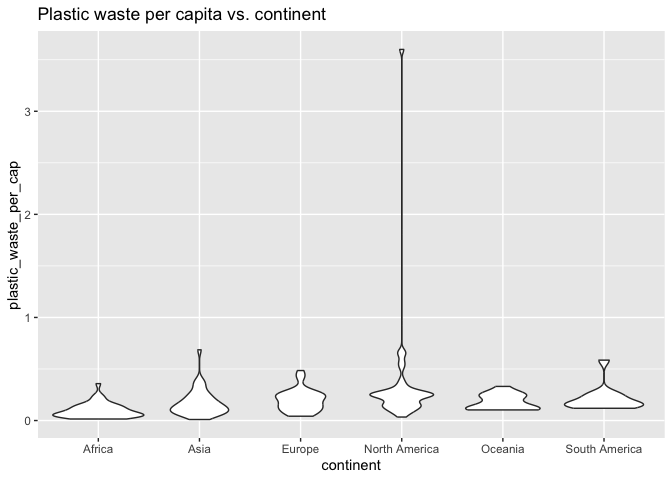
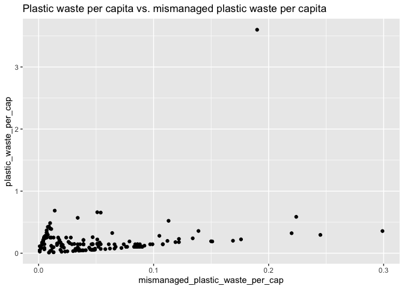
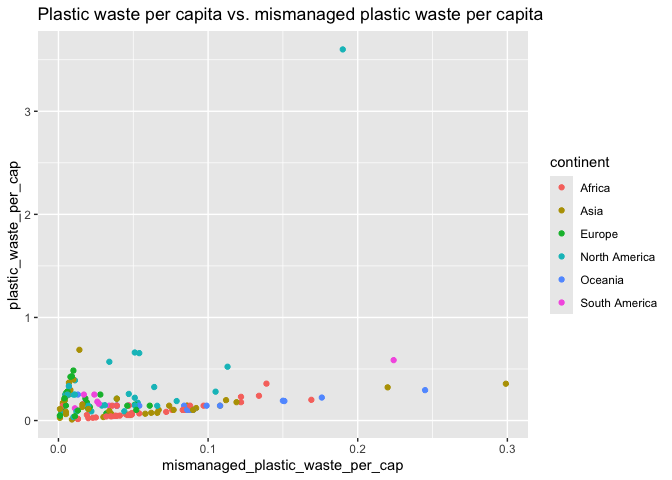
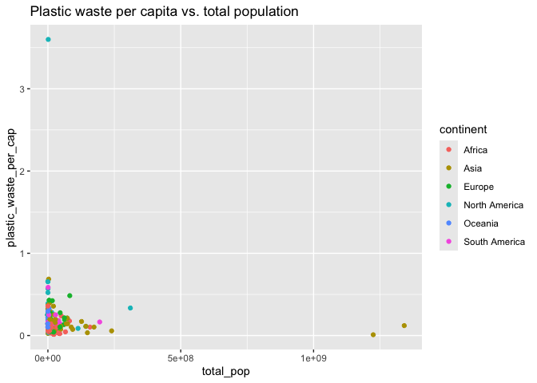
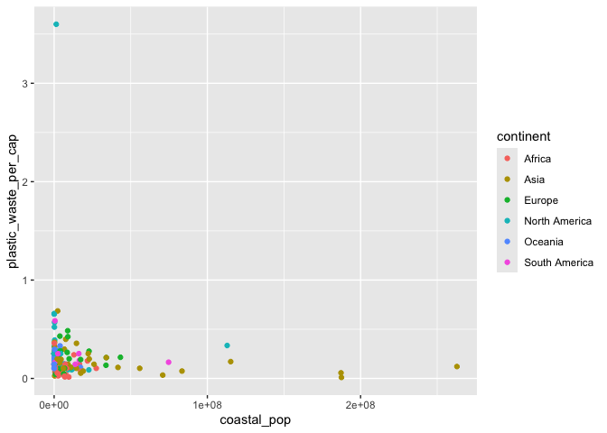
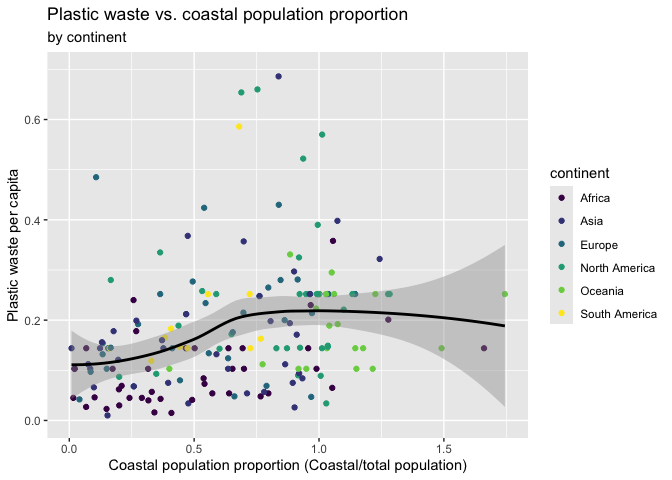

Lab 02 - Plastic waste
================
Lilly McClendon
2025-01-23

## Load packages and data

``` r
library(tidyverse) 
```

``` r
plastic_waste <- read.csv("data/plastic-waste.csv")
```

## Exercises

### Exercise 1

``` r
ggplot(data = plastic_waste, aes(x = plastic_waste_per_cap)) +
  geom_histogram(binwidth = 0.2) + 
  labs(title = "Plastic waste per capita in 2010")
```

    ## Warning: Removed 51 rows containing non-finite outside the scale range
    ## (`stat_bin()`).

<!-- -->

``` r
plastic_waste %>%
  filter(plastic_waste_per_cap > 3.5)
```

    ##   code              entity     continent year gdp_per_cap plastic_waste_per_cap
    ## 1  TTO Trinidad and Tobago North America 2010    31260.91                   3.6
    ##   mismanaged_plastic_waste_per_cap mismanaged_plastic_waste coastal_pop
    ## 1                             0.19                    94066     1358433
    ##   total_pop
    ## 1   1341465

##### Factors related to high plastic waste per capita in Trinidad and Tobago

According to Kanhai and colleagues in 2024, individuals in Trinidad and
Tobago use plastics because of their affordable price, need, little
belief that they can change their behavior, and convenience.
Additionally, Kanhai and colleagues in 2024 found factors such as social
norms and convenience are predictors for single-use plastics. Further,
even with increasing awareness of recycling, only half of people
recycled, potentially due to inaccessibility of recycling.

#### 1.1 histogram plot of distribution of plastic waster per capita faceted by continent

``` r
ggplot(plastic_waste, aes(x=plastic_waste_per_cap)) +
  geom_histogram() +
  facet_wrap(~continent) +
  labs(title = "Plastic waste per capita by country")
```

    ## `stat_bin()` using `bins = 30`. Pick better value with `binwidth`.

    ## Warning: Removed 51 rows containing non-finite outside the scale range
    ## (`stat_bin()`).

<!-- -->

##### Continent comparison of plastic waster per capita

Surprisingly it seems like the continents all share similar patterns
except for South America which appears to have a drastically smaller
plastic waste per capita.

### Exercise 2

#### Density plots

``` r
ggplot(data = plastic_waste, aes(x = plastic_waste_per_cap)) +
  geom_density() + 
  labs(title = "Plastic waste per capita by continent")
```

    ## Warning: Removed 51 rows containing non-finite outside the scale range
    ## (`stat_density()`).

<!-- -->

``` r
ggplot(data = plastic_waste,aes(x = plastic_waste_per_cap, shape = continent)) +
  geom_density() + 
  labs(title = "Plastic waste per capita by continent")
```

    ## Warning: Removed 51 rows containing non-finite outside the scale range
    ## (`stat_density()`).

<!-- -->

#### Density plots color coded by continent

``` r
ggplot(data = plastic_waste, mapping = aes(x = plastic_waste_per_cap, color = continent)) +
  geom_density() + 
  labs(title = "Plastic waste per capita by continent")
```

    ## Warning: Removed 51 rows containing non-finite outside the scale range
    ## (`stat_density()`).

<!-- -->

#### Density plots filled curves

``` r
ggplot(data = plastic_waste, mapping = aes(x = plastic_waste_per_cap, color = continent, fill = continent)) +
  geom_density() + 
  labs(title = "Plastic waste per capita by continent")
```

    ## Warning: Removed 51 rows containing non-finite outside the scale range
    ## (`stat_density()`).

<!-- -->

#### 2.1 Desnity Plots with different Alphas

``` r
ggplot(data = plastic_waste, mapping = aes(x = plastic_waste_per_cap, color = continent, fill = continent)) +
  geom_density(alpha = .25) + 
  labs(title = "Plastic waste per capita by continent")
```

    ## Warning: Removed 51 rows containing non-finite outside the scale range
    ## (`stat_density()`).

<!-- -->

##### 2.1 Definition of color and fill by mapping aesthetics and definition of alpha levels as characteristic of plotting geom.

We defined color and fill as mapping aesthetics because we wanted the
color and fill to be based on the values of a variable in the data, in
this case continent. We defined alpha levels as characteristics of
plotting geom because we wanted to modify how transparent the points
were from 0-totally transparent to 1-totally solid. The alpha values
were therefore not based on the values of a variable in the data so we
defined the alpha level as a characteristic of the plotting geom.

### Exercise 3

``` r
ggplot(data = plastic_waste,mapping = aes(x = continent, y = plastic_waste_per_cap)) +
  geom_boxplot() + 
  labs(title = "Plastic waste per capita vs. continent")
```

    ## Warning: Removed 51 rows containing non-finite outside the scale range
    ## (`stat_boxplot()`).

<!-- -->

#### 3.1 Convert side-by-side box plots to violin plots

``` r
ggplot(plastic_waste, aes(x = continent, y=plastic_waste_per_cap))+
  geom_violin() + 
  labs(title = "Plastic waste per capita vs. continent")
```

    ## Warning: Removed 51 rows containing non-finite outside the scale range
    ## (`stat_ydensity()`).

<!-- -->

##### Violin plots compared to box plots

In addition to reflecting summary statistics like the box plots, a
unique feature of violin plots is that you can see the density of each
variable (similar to a flipped histogram). Rather than showing bars to
represent the data, the distribution itself is plotted turned. So if you
look at the violin plot of South America you can see that the data is
densest near the 0 plastic waste per capita.

##### Features of box plots not displayed in violin plots

In contrast to violin plots, box plots display the specific values of
the summary statistics like the quartiles, median, and clearly
distinguish outliers. The line inside the box represents the median
value, and the bottom horizontal edge of the box represents the first
quartile and the top horizontal edge of the box represents the third
quartile.

### Exercise 4

#### 4.1 Visualize relationship between plastic waste per capita and mismanaged plastic waste per capita with a scatterplot

``` r
ggplot(plastic_waste, aes(x = mismanaged_plastic_waste_per_cap, y = plastic_waste_per_cap)) + 
  geom_point() + 
  labs(title = "Plastic waste per capita vs. mismanaged plastic waste per capita")
```

    ## Warning: Removed 51 rows containing missing values or values outside the scale range
    ## (`geom_point()`).

<!-- -->

##### 4.1 Description of relationship (scatterplot of relationship between plastic waste per capita and mismanaged plastic waste per capita)

This scatterplot shows a weak, positive linear relationship between
plastic waste per capita and mismanaged plastic waste per capita and one
clear outlier in the data.

#### 4.2 Color scatterplot points by continent

``` r
ggplot(plastic_waste, aes(x = mismanaged_plastic_waste_per_cap, y = plastic_waste_per_cap, color = continent)) + 
  geom_point() + 
  labs(title = "Plastic waste per capita vs. mismanaged plastic waste per capita")
```

    ## Warning: Removed 51 rows containing missing values or values outside the scale range
    ## (`geom_point()`).

<!-- -->

##### 4.2 Distinctions between continents with how plastic waste per capita and mismanaged plastic waste per capita are associated

It seems that there is a stronger linear relationship for Africa
compared to other countries. For example it seems as though North
America has weaker association.

#### 4.3 Relationship between plastic waste per capita and total population

``` r
ggplot(plastic_waste, aes(x = total_pop, y = plastic_waste_per_cap, color = continent)) + 
  geom_point() + 
  labs(title = "Plastic waste per capita vs. total population")
```

    ## Warning: Removed 61 rows containing missing values or values outside the scale range
    ## (`geom_point()`).

<!-- -->

#### 4.3 Relationship between plastic waste per capita and coastal population

``` r
ggplot(plastic_waste, aes(x = coastal_pop , y = plastic_waste_per_cap, color = continent)) + 
  geom_point()
```

    ## Warning: Removed 51 rows containing missing values or values outside the scale range
    ## (`geom_point()`).

<!-- -->

``` r
  labs(title = "Plastic waste per capita vs. coastal population")
```

    ## $title
    ## [1] "Plastic waste per capita vs. coastal population"
    ## 
    ## attr(,"class")
    ## [1] "labels"

##### 4.3

The relationship between plastic waste per capita and total population
and the relationship between plastic waste per capita and coastal
population appear to be similiarly linearly associated. I would say that
one is not more strongly linearly associated than the other.

### Exercise 5

``` r
plastic_waste %>%
  filter(plastic_waste_per_cap > 3.0)
```

    ##   code              entity     continent year gdp_per_cap plastic_waste_per_cap
    ## 1  TTO Trinidad and Tobago North America 2010    31260.91                   3.6
    ##   mismanaged_plastic_waste_per_cap mismanaged_plastic_waste coastal_pop
    ## 1                             0.19                    94066     1358433
    ##   total_pop
    ## 1   1341465

``` r
ggplot(plastic_waste, aes(x = (coastal_pop/total_pop), y =plastic_waste_per_cap)) + 
  geom_point(aes(color = continent)) +
  xlim(0, 1.75) + 
  ylim(0, 0.7) + 
  labs(title = "Plastic waste vs. coastal population proportion", subtitle = "by continent", x = "Coastal population proportion (Coastal/total population)", y = "Plastic waste per capita") +
  scale_color_viridis_d() + 
  geom_smooth(method = "loess", col = "black")
```

    ## `geom_smooth()` using formula = 'y ~ x'

    ## Warning: Removed 62 rows containing non-finite outside the scale range
    ## (`stat_smooth()`).

    ## Warning: Removed 62 rows containing missing values or values outside the scale range
    ## (`geom_point()`).

<!-- -->

##### 5.1 Overall there is a weak positive association between plastic waste per capita and coastal population proportion. It appears that as there is a higher density of popualtion at the coast, there is in increase in plastic waste per capita. It may be that people who reside on the coast are more likely to consume more single-use plastic.

### References

Kanhai, L. D. K., Keller, E., & Richter, I. (2024). The human dimension
of plastic pollution in the Caribbean SIDS of Trinidad and Tobago.
Environmental Science & Policy, 159, 103820-.
<https://doi.org/10.1016/j.envsci.2024.103820>
